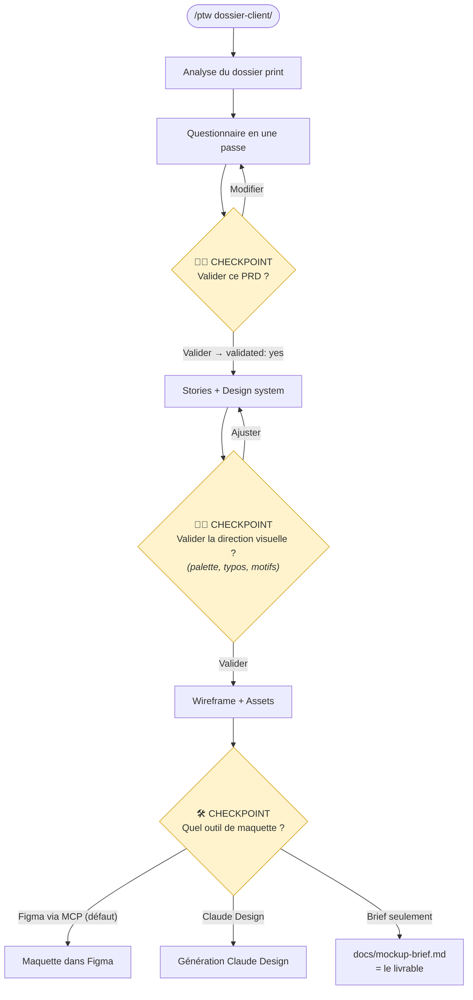
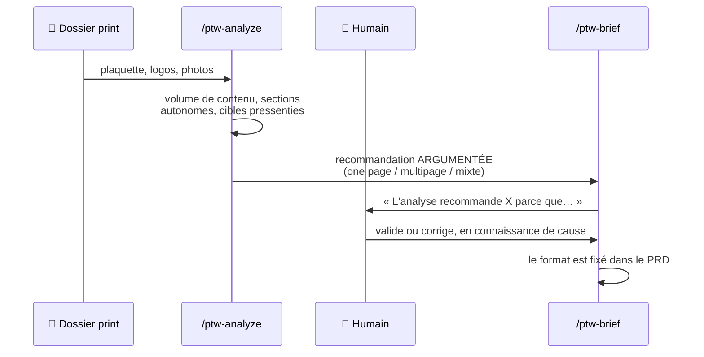

<div align="center">

# 🖨️ → 🌐 print-to-web

**D'un document print à une maquette web — en posant les bonnes questions une seule fois.**

Un pipeline agentique pour [Claude Code](https://claude.com/claude-code) et [Codex](https://openai.com/codex) qui transforme une plaquette, un flyer ou une carte de visite en maquette de site web prête à être retravaillée par un designer.

[](https://claude.com/claude-code)
[](https://openai.com/codex)
[](LICENSE)

</div>

---

## Le problème

Un client vous tend sa plaquette PDF, ses logos et un dossier de photos : *« il me faudrait un site »*. Entre ce moment et la première maquette, il se passe d'habitude : des allers-retours de questions oubliées, du lorem ipsum qui masque les trous de contenu, une identité visuelle réinterprétée de mémoire, et des images print de 6 Mo collées telles quelles dans le web.

**print-to-web** structure ce passage en un pipeline où :

- 🔍 l'analyse du dossier print vient **avant** les questions — on ne demande jamais ce qui est déjà dans la plaquette ;
- ❓ le questionnaire de cadrage se fait **en une seule passe**, éclairé par l'analyse ;
- 🎨 l'identité visuelle est **extraite** du print et des inspirations — jamais inventée ;
- ✍️ le lorem ipsum est **interdit** — tout contenu vient du print, ou reste un `TROU DE CONTENU` visible ;
- 🖼️ les images sont optimisées (resize + WebP) **sans toucher aux originaux** ;
- 📐 la maquette arrive dans **Figma** (via MCP) ou **Claude Design**, ancrée sur un design system documenté.

## Le pipeline en un schéma

```mermaid
flowchart LR
    subgraph inputs["📁 Entrées"]
        P["📄 Plaquette PDF<br/>🎨 Logos<br/>📷 Photos & perspectives"]
        I["💡 Inspirations<br/>(explorations du designer)"]
    end

    subgraph framing["Cadrage"]
        A["1 · /ptw-analyze<br/><i>inventaire, identité,<br/>format recommandé</i>"]
        B["2 · /ptw-brief<br/><i>LE questionnaire,<br/>une seule passe</i>"]
        S["3 · /ptw-stories<br/><i>5-12 stories visiteur</i>"]
    end

    subgraph design["Conception"]
        D["4 · /ptw-design-system<br/><i>tokens + prompts design</i>"]
        W["5 · /ptw-wireframe<br/><i>squelette, vrai contenu</i>"]
        AS["6 · /ptw-assets<br/><i>resize + WebP</i>"]
    end

    subgraph deliver["Livrables"]
        M["7 · /ptw-mockup<br/><i>🎨 maquette Figma</i>"]
        H["8 · /ptw-html<br/><i>bonus : prototype</i>"]
    end

    P --> A
    A -->|"docs/analyse.md"| B
    B -->|"docs/prd.md ✅"| S
    S --> D
    I --> D
    D -->|"docs/design-system.md"| W
    W -->|"docs/wireframe.md"| AS
    AS -->|"assets/web/ + manifeste"| M
    M -.->|"docs/mockup-brief.md"| H

    style inputs fill:#f5f0e8,stroke:#d97757
    style deliver fill:#e8f0f5,stroke:#4a90d9
```



Chaque phase écrit un fichier markdown sous `docs/` — **l'état du projet se dérive des fichiers**, pas d'une base ni d'un fichier d'état. `/ptw-status` vous dit toujours où vous en êtes et quelle est la prochaine commande.

## Les checkpoints humains

`/ptw <dossier>` enchaîne tout le pipeline, mais trois décisions restent humaines — ce sont de vrais points d'arrêt, pas des questions rhétoriques :



> [!IMPORTANT]
> **Les gates sont mécaniques et fail-closed.** Pas de brief sans analyse. Pas de maquette sans PRD validé (`docs/prd.md` → frontmatter `validated: yes`), ni sans design system et wireframe. Un fichier qui existe ne vaut pas validation : seul le checkpoint humain pose le marqueur.

## Pourquoi ça marche : le format se décide au bon moment

La question *« one page ou site multipage ? »* est piégée si on la pose à froid. Le pipeline la traite en deux temps :



Le même principe s'applique partout : **l'agent constate et propose, l'humain tranche, le fichier fait foi.**

## Commandes

| Commande | Rôle | Sortie |
|---|---|---|
| `/ptw <dossier>` | 🎼 Orchestrateur complet, checkpoints compris | tout ce qui suit |
| `/ptw-analyze <dossier>` | Analyse du print : assets, identité, contenu, format recommandé | `docs/analyse.md` |
| `/ptw-brief` | Questionnaire en une passe → PRD validé — chaque contenu est **primaire** (dans la page), **secondaire** (popup, accordéon, annexe) ou au **cimetière** | `docs/prd.md` |
| `/ptw-stories` | 5-12 stories visiteur, jamais overkill | `docs/stories.md` |
| `/ptw-design-system` | Tokens extraits du print + inspirations + prompts design | `docs/design-system.md` |
| `/ptw-wireframe` | Squelette ASCII mappé sur le contenu réel | `docs/wireframe.md` |
| `/ptw-assets` | Resize + WebP sans dégradation, originaux intacts | `assets/web/` + `docs/assets.md` |
| `/ptw-mockup` | Brief autonome puis maquette Figma (MCP) ou Claude Design | `docs/mockup-brief.md` + fichier Figma |
| `/ptw-html` | Bonus : prototype HTML/CSS navigable | `site/index.html` |
| `/ptw-review [doc\|all]` | Relecture à contexte vierge par un **agent différent** (Codex si installé, sinon sous-agent) : clarté pour un lecteur non technique, cohérence entre les docs, fidélité au print | `docs/reviews/<doc>.md` |
| `/ptw-status` | État du projet dérivé des fichiers | — |
| `/ptw-update` | Détecte une nouvelle version du plugin et l'applique | — |
| `/ptw-help` | Antisèche du pipeline | — |

## Installation

L'installeur dépose ses fichiers dans le répertoire d'où vous le lancez — vous ne clonez pas ce repo dans votre projet.

**En une ligne, depuis la racine de votre projet :**

```bash
curl -fsSL https://raw.githubusercontent.com/Dupflo/print-to-web/main/install.sh | bash
```

**Ou depuis un clone :**

```bash
git clone https://github.com/Dupflo/print-to-web.git ~/tools/print-to-web
cd votre-projet
~/tools/print-to-web/install.sh
```

### Cibles et portées

Une source de vérité (`src/`), un installeur, une sortie par outil :

```bash
./install.sh                           # Claude Code, projet (défaut)
./install.sh --target codex            # Codex, projet → .codex/skills + AGENTS.md
./install.sh --target all              # Claude + Codex, projet
./install.sh --global                  # Claude, global (commandes dans tous les repos)
./install.sh --global --target codex   # Codex, global → ~/.codex/skills
./install.sh --global --target all     # les deux, global
```

Après une install globale, posez les fichiers par projet (templates + rules) :

```bash
~/.claude/print-to-web/install.sh init                 # Claude
~/.claude/print-to-web/install.sh init --target codex  # Codex
```

`AGENTS.md` (les règles) est partagé et lu nativement par les deux outils ; sur Claude, un `CLAUDE.md` d'une ligne l'importe. Les commandes `ptw-*` sont émises en skills Codex par `bin/ptw-build.mjs` (zéro dépendance, Node requis pour la cible codex uniquement).

### Mise à jour

Le plus simple, depuis l'agent : `/ptw-update` — détecte si une version plus récente existe sur GitHub et l'applique après confirmation.

En ligne de commande :

```bash
./install.sh check                     # compare la version installée au dépôt (exit 10 si maj dispo)
./install.sh update                    # Claude
./install.sh update --target codex     # Codex
curl -fsSL https://raw.githubusercontent.com/Dupflo/print-to-web/main/install.sh | bash -s -- update
```

Remplace proprement le tooling (tracké dans `.ptw-manifest` — vos propres commandes ne sont jamais touchées), rafraîchit les templates non modifiés (un template modifié localement n'est jamais écrasé sans `--force`), ne touche jamais `AGENTS.md`.

## Ce que le pipeline attend en entrée

```
dossier-client/
├── plaquette.pdf              # la source de contenu principale
├── logos/                     # toutes les variantes (couleur, noir, blanc — SVG/PDF bienvenus)
├── photos/                    # perspectives, photos de terrain…
├── plans/                     # optionnel : plans, coupes, schémas techniques
└── inspirations/              # optionnel mais précieux : ce que le designer a déjà exploré
```

Et ce qu'il produit :

```
votre-projet/
├── docs/
│   ├── analyse.md             # inventaire + identité + format recommandé
│   ├── prd.md                 # périmètre validé (frontmatter validated: yes)
│   ├── stories.md             # stories visiteur
│   ├── design-system.md       # tokens + prompts design
│   ├── wireframe.md           # squelette + mapping contenu réel
│   ├── assets.md              # manifeste original → optimisé
│   └── mockup-brief.md        # brief de maquette autonome et réutilisable
├── assets/web/                # images WebP optimisées
└── site/                      # bonus : prototype HTML
```

> [!TIP]
> `docs/mockup-brief.md` est écrit **avant** toute génération, quel que soit l'outil choisi. C'est un document autonome : n'importe quel designer (ou n'importe quel autre outil) peut produire la maquette à partir de ce seul fichier.

## Philosophie

1. **Les bonnes questions, une seule fois.** Le coût caché d'un projet print → web, ce sont les allers-retours. Tout le pipeline existe pour que le questionnaire de `/ptw-brief` soit complet et éclairé.
2. **L'agent constate, l'humain tranche.** Recommandation de format, direction visuelle, outil de maquette : trois checkpoints, trois vraies décisions humaines.
3. **Rien d'inventé.** Ni couleur, ni fonte, ni texte. Ce qui manque est un `TROU DE CONTENU` assumé — une information pour le client, pas un défaut à masquer.
4. **L'état vit dans les fichiers.** Markdown sous `docs/`, versionné si le projet est un repo git. Un état dérivé ne périme pas.
5. **Langage clair, pas de jargon.** Les docs sont lus par un designer et son client, pas par un développeur. Les termes techniques sans explication (« scope creep », « above the fold »…) sont bannis des questions et des livrables — c'est même un critère de la relecture `/ptw-review`.
6. **Instructions en anglais, sorties dans votre langue.** Les commandes et règles (`src/`) sont en anglais — la norme de l'écosystème, et le plus fiable pour les modèles. Mais l'agent vous parle et écrit les `docs/` dans la langue de vos documents print : plaquette française → PRD, wireframe et maquette en français.

## Contribuer

Les issues et PR sont bienvenues. La source canonique est `src/` (format Claude) ; `bin/ptw-build.mjs` émet les autres cibles. Pour tester une modification : `./install.sh --target all` dans un projet jetable.

## Crédits

Architecture d'installeur et philosophie de pipeline inspirées de [killer-saas](https://github.com/MikeCodeur/killer-saas) de MikeCodeur.

## Licence

[MIT](LICENSE)
